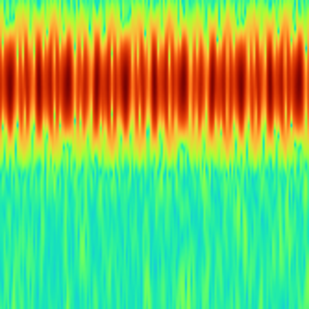
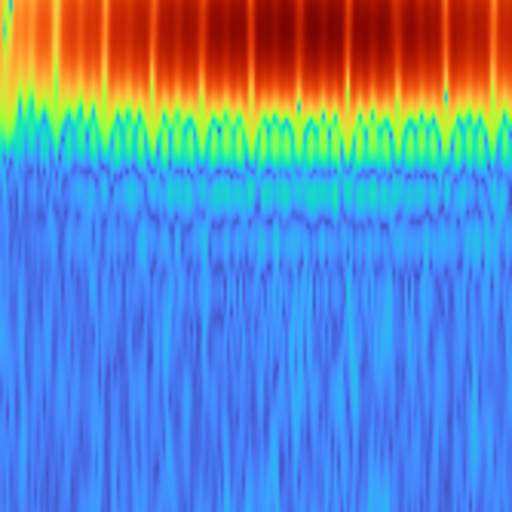
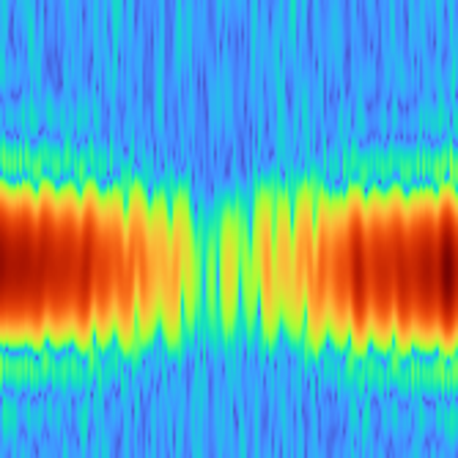
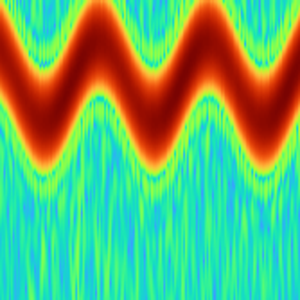
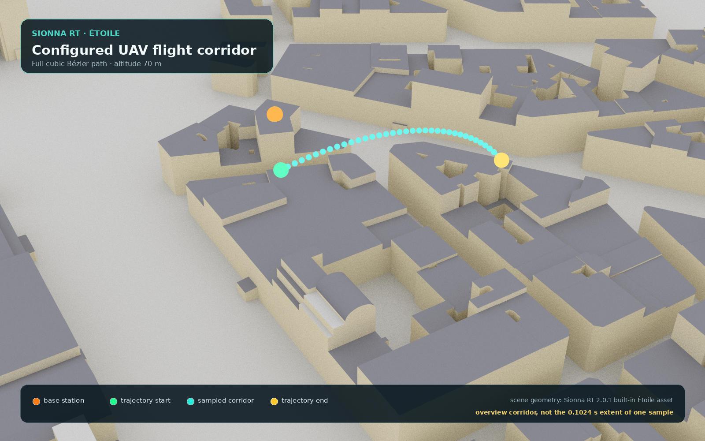
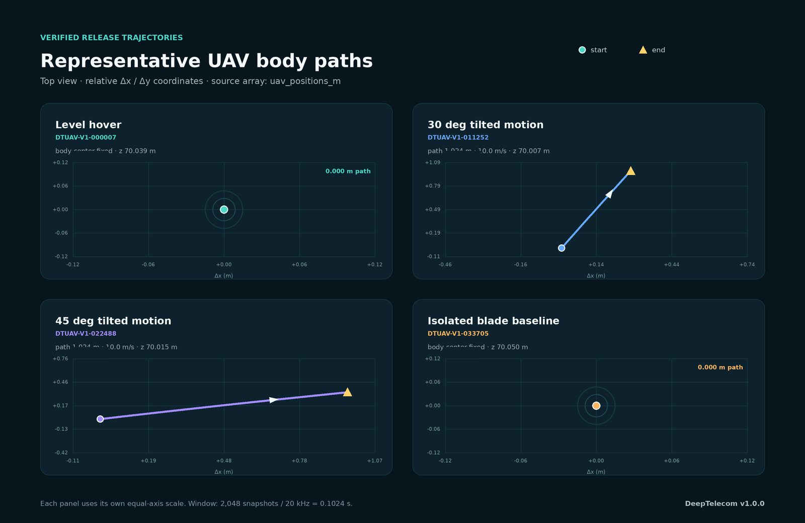

# DeepTelecom UAV Dataset v1

DeepTelecom UAV Dataset v1 is a ray-tracing-derived UAV wireless sensing dataset published as deterministic, integrity-verifiable WebDataset shards. The frozen `v1.0.0` release contains **44,988 accepted samples** in **140 TAR shards**, with continuous public IDs from `DTUAV-V1-000001` to `DTUAV-V1-044988`.

**中文简介：** DeepTelecom v1 面向无人机无线传播与微多普勒研究。浙江大学信息与电子工程学院项目团队将三套计算环境中的分散输出统一清点、清洗、核验、重新编号并打包，形成 44,988 个可追溯样本。这里发布的不是简单目录快照，而是一套带公开 ID、样本合同、全局 manifest、SHA-256 和固定版本的数据发布。

> Modeling boundary: this is a moving point-scatterer monostatic-return approximation built on Sionna RT. It is neither measured flight data nor a full-wave simulation with a physical UAV mesh/RCS model.

- Dataset: [Hugging Face `v1.0.0`](https://huggingface.co/datasets/KYGOYUAN/DeepTelecom_Partial/tree/v1.0.0)
- Exact frozen revision: [`de7fc35cb41af3d9c5b2f52dab5483e3ceb623b3`](https://huggingface.co/datasets/KYGOYUAN/DeepTelecom_Partial/tree/de7fc35cb41af3d9c5b2f52dab5483e3ceb623b3)
- Project website: [DeepTelecom Pages](https://kygoyuan2004.github.io/DeepTelecom_Partial/)
- Sample gallery: [verified release examples](https://kygoyuan2004.github.io/DeepTelecom_Partial/gallery/)
- Generation method: [model, parameters, and extension guide](https://kygoyuan2004.github.io/DeepTelecom_Partial/generation/)
- Integrity manifest: [SHA256SUMS](https://huggingface.co/datasets/KYGOYUAN/DeepTelecom_Partial/resolve/de7fc35cb41af3d9c5b2f52dab5483e3ceb623b3/checksums/v1/SHA256SUMS)

## Data layout

The approximately 149 GB payload lives on Hugging Face. This GitHub repository contains its documentation, frozen compressed manifest, schema, checksums, helper scripts, and website—not the TAR/NPZ/PNG payload.

```text
Hugging Face
├── data/v1/shards/shard-00000.tar ... shard-00139.tar
├── manifests/v1/
├── schemas/v1/sample.schema.json
├── checksums/v1/SHA256SUMS
└── dataset_registry.json

GitHub
├── manifests/v1/all_samples.jsonl.gz
├── schemas/sample-v1.schema.json
├── checksums/v1/SHA256SUMS
├── scripts/
└── site/
```

There are no source-machine directories in the public data layout. Provenance is retained as metadata fields, never encoded into public shard paths or filenames.

## Sample contract

Each public ID occurs in exactly one shard and has exactly three members:

```text
DTUAV-V1-000001.npz   # tensor arrays; source bytes preserved
DTUAV-V1-000001.png   # paired visualization; source bytes preserved
DTUAV-V1-000001.json  # normalized metadata sidecar
```

The JSON sidecar follows [`schemas/sample-v1.schema.json`](schemas/sample-v1.schema.json). The flat `all_samples.jsonl.gz` allocation/provenance manifest is a different record type and does not itself claim to satisfy the sidecar schema.

| Sidecar field | Meaning |
|---|---|
| `global_sample_id` | Immutable public `DTUAV-V1-XXXXXX` identifier |
| `class_id` | One of the four frozen class labels |
| `tensor_schema_id` | Selects the 32-key or legacy 24-key tensor contract |
| `semantic_sha256` | Deterministic semantic digest of tensor content |
| `target_shard` | Unified public TAR path |
| `members` | Exact NPZ, PNG, and JSON member names |
| `files` | NPZ/PNG byte counts and SHA-256 values |
| `provenance` | Source metadata retained without changing public paths |

## Counts

| Human-readable condition | Class ID | Generator condition | Scatterers | Samples |
|---|---|---|---:|---:|
| Level hover | `level_v0` | 0° tilt, 0 m/s body translation; rotors continue to turn | 25 | 11,249 |
| 30° pitched flight | `pitch30_v10` | 30° rotation about the simulation y-axis, 10 m/s path speed | 25 | 11,236 |
| 45° pitched flight | `pitch45_v10` | 45° rotation about the simulation y-axis, 10 m/s path speed | 25 | 11,219 |
| Isolated blade baseline | `single_blade_v0` | One rotating blade-tip scatterer, 0 m/s center translation | 1 | 11,284 |
| **Total** |  |  |  | **44,988** |

In these generator labels, `pitchNN` encodes the configured attitude angle in degrees and `vNN` encodes body/path speed in metres per second. The positive angle is applied through a y-axis rotation; the release does not label it as nose-up or nose-down. `single_blade_v0` is a reduced control model, not a single-rotor aircraft. The other three conditions use one body point plus four rotors × two blades × three radial points per blade, for 25 scatterers.

The tensors comprise 44,948 `dtuav-etoile-32key-v1` samples and 40 early formal `dtuav-floor-wall-24key-v1` samples. The outer NPZ + PNG + JSON protocol is uniform, while `tensor_schema_id` selects the tensor schema; missing legacy arrays were not fabricated.

The 140 TAR files contain 134,964 members and total 148,989,562,880 bytes. This release intentionally defines **no train/validation/test split**.

## Verified sample previews

These four PNGs are real members of the frozen release, not illustrations. Each source PNG/NPZ was checked against its published TAR member and global-manifest SHA-256. Exact per-sample parameters are listed in the bilingual [sample gallery](https://kygoyuan2004.github.io/DeepTelecom_Partial/gallery/).

| Level hover | 30° pitched flight |
|---|---|
| [](https://kygoyuan2004.github.io/DeepTelecom_Partial/gallery/) | [](https://kygoyuan2004.github.io/DeepTelecom_Partial/gallery/) |
| `DTUAV-V1-000007` · 0° · 0 m/s · 25 points | `DTUAV-V1-011252` · 30° · 10 m/s · 25 points |

| 45° pitched flight | Isolated blade baseline |
|---|---|
| [](https://kygoyuan2004.github.io/DeepTelecom_Partial/gallery/) | [](https://kygoyuan2004.github.io/DeepTelecom_Partial/gallery/) |
| `DTUAV-V1-022488` · 45° · 10 m/s · 25 points | `DTUAV-V1-033705` · 0° · 0 m/s · 1 blade-tip point |

## Scene and verified flight paths

[](https://kygoyuan2004.github.io/DeepTelecom_Partial/gallery/#trajectories)

The scene view above is rendered directly from the Sionna RT 2.0.1 built-in Étoile asset used by the portable generator. It marks the base station at `(78.9293, 32.0468, 28.9687) m` and the complete 88.914 m cubic Bézier corridor at 70 m altitude. It is a configuration overview—not a claim that one 0.1024 s sample traverses the entire corridor.

[](https://kygoyuan2004.github.io/DeepTelecom_Partial/gallery/#trajectories)

The second figure is data-derived: it reads `uav_positions_m` from the same four verified release NPZ files shown above. The two 10 m/s samples travel approximately 1.024 m inside the observation window; the hover and isolated-blade controls keep their body center fixed while their rotor or blade-tip scatterers continue moving. Exact absolute start/end coordinates are recorded in [`site/data/gallery.json`](site/data/gallery.json).

## Quick start

Download a shard range at the immutable revision:

```bash
python scripts/download_dataset.py --output-dir DeepTelecom_Partial --start 0 --end 3
```

Verify files against the frozen checksum manifest:

```bash
python scripts/verify_dataset.py DeepTelecom_Partial --start-shard 0 --end-shard 3 --deep
```

Inspect samples without extracting a TAR:

```bash
python scripts/load_webdataset.py DeepTelecom_Partial/data/v1/shards/shard-00000.tar --limit 2
```

The scripts default to the exact HF revision `de7fc35cb41af3d9c5b2f52dab5483e3ceb623b3`, not the floating `main` branch. See each command's `--help` for range, retry, verification, and loading options.

For direct CLI download:

```bash
hf download KYGOYUAN/DeepTelecom_Partial \
  --repo-type dataset \
  --revision de7fc35cb41af3d9c5b2f52dab5483e3ceb623b3 \
  --include "data/v1/shards/*.tar" \
  --include "manifests/v1/*" \
  --include "schemas/v1/*" \
  --include "checksums/v1/SHA256SUMS" \
  --local-dir DeepTelecom_Partial
```

## Curation and integrity

Before freezing the candidate set, the scan excluded 39,240 local physical copies, 1 truly invalid zero-length sample, 1,077 incomplete records, and 5,109 performance/smoke/single-site/log or other non-formal records. Seventy original-ID conflict groups (144 records) had different content and were retained with distinct global IDs. There are no held conflicts and no cross-source content duplicate removed from the 44,988 frozen candidates.

Every shard is tied to its allocation-row digest and SHA-256 in the release registry. The checked upload chain, frozen metadata, and all 140 LFS objects resolve through both the full commit above and the immutable `v1.0.0` tag. [`checksums/v1/SHA256SUMS`](checksums/v1/SHA256SUMS) is a byte-identical copy of the HF release checksum file, so paths in it are relative to a downloaded HF repository root.

## Generation code

The cleaned, reusable point-scatterer generator is published in [`generator/`](generator/), with Chinese and English guides. Its method is:

```text
class attitude/speed + trajectory
  -> moving body and blade scatterer probes
  -> per-snapshot Sionna RT one-way CIR
  -> weighted coherent monostatic-return approximation + AWGN
  -> STFT
  -> NPZ tensor + PNG preview + metadata
```

This is a point-scatterer monostatic-return approximation built on Sionna RT, not a full-wave UAV mesh/RCS simulation and not measured flight data. The configuration supports changing radial points per blade, blade count, straight-line motion, and a single cubic Bézier path. The current topology is fixed to four rotors; arbitrary rotor layouts and waypoint/multi-segment paths are documented as extension work rather than claimed as existing features.

Four representative release PNGs and their exact paired-NPZ parameters are available in the [sample gallery](https://kygoyuan2004.github.io/DeepTelecom_Partial/gallery/). Their source PNG/NPZ bytes were checked against both the published TAR members and the global manifest.

## Project organization

DeepTelecom is organized by a project team at the [College of Information Science and Electronic Engineering (ISEE), Zhejiang University](https://www.isee.zju.edu.cn/). This statement identifies the project organization and does not imply additional institutional endorsement beyond what is explicitly stated.

## License

The code and documentation in this GitHub repository are licensed under [Apache-2.0](LICENSE). That repository license does not assert a separate license grant for the dataset payload.
